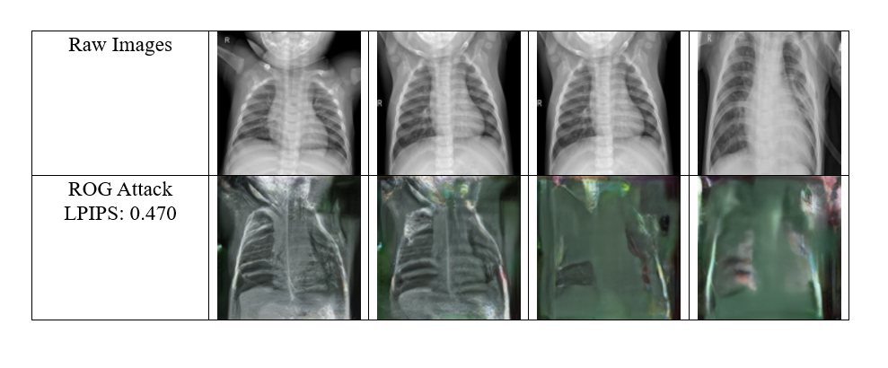

# Exploring Privacy Risks: Reconstructing Medical Images from Obfuscated Gradients in Federated Learning

## Credits

This project is inspired by and builds upon the work of [Kai Yue, Richeng Jin, Chau-Wai Wong, Dror Baron, and Huaiyu Dai] in their paper "Gradient Obfuscation Gives a False Sense of Security in Federated Learning". I extend my sincere appreciation to them for their valuable contributions to the field of federated learning and privacy-preserving machine learning. 

- Link to the Research Paper: [Gradient Obfuscation Gives a False Sense of Security in Federated Learning](https://arxiv.org/abs/2206.04055)
- Link to the REPO : [ROG-REPO](https://github.com/KAI-YUE/rog).

During my data privacy course at UNC Charlotte, I was asked to present the above paper as part of the course curriculum. It was during this presentation that I became interested in the project and decided to work on it for my own project.

## Introduction

Federated learning, a collaborative machine learning framework, has gained traction for its ability to train models across decentralized data sources without sharing raw data. However, concerns persist regarding privacy vulnerabilities, particularly in sensitive domains like medical image analysis. Leveraging a reconstruction attack framework proposed by Yue et al., this project investigates the efficacy of gradient obfuscation techniques in safeguarding patient privacy within federated learning settings.

## Project Overview

### Motivation and Objectives
With the aim of balancing privacy protection and model utility in healthcare, this project assesses the effectiveness of gradient obfuscation techniques, including intentional noise injection and unintentional compression, in mitigating reconstruction attacks on medical image datasets. The primary objectives include:
- Evaluating privacy risks associated with federated learning in medical image analysis.
- Assessing the impact of gradient obfuscation techniques on model privacy and performance.

## Usage

For instructions on running the code and reproducing the experiments, please refer to the accompanying [Instructions Notebook](https://github.com/manognachennuru/manogna-dataprivacy-project/blob/main/dp_project_instructions.ipynb).

## Dataset Used

For this project, I utilized the Chest X-Ray Pneumonia dataset available on Kaggle. This dataset contains X-ray images of patients with and without pneumonia, making it suitable for evaluating privacy risks in medical image analysis within federated learning settings.

[Link to Dataset](https://www.kaggle.com/datasets/paultimothymooney/chest-xray-pneumonia)

## Results

After conducting experiments and evaluations, I observed significant insights regarding the effectiveness of gradient obfuscation techniques in safeguarding patient privacy within federated learning. The results are summarized in the image below:

